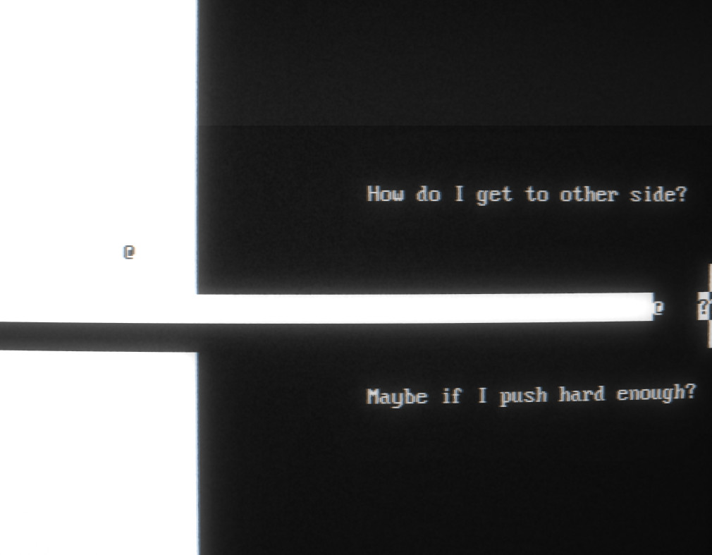

# ggj22-kiwi
Game made during 48 hours for Global game jam 2022. https://globalgamejam.org/2022/games/kiwi-9

Features sokoban like puzle mechanics with a twist based on switching between black and white half of level.
Uses terminal graphics. For best experience recommended playing on Linux or macOS. Windows version flickers a lot more.

## State of the project

* Is this good code? No! It was written in 48 hours by person who hasn't touched rust in a long time.
* Is this project maintained? No, at the moment there are currently no plans updating it after end of game jam.

